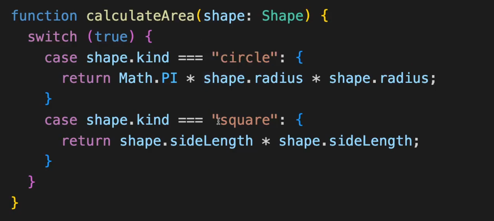
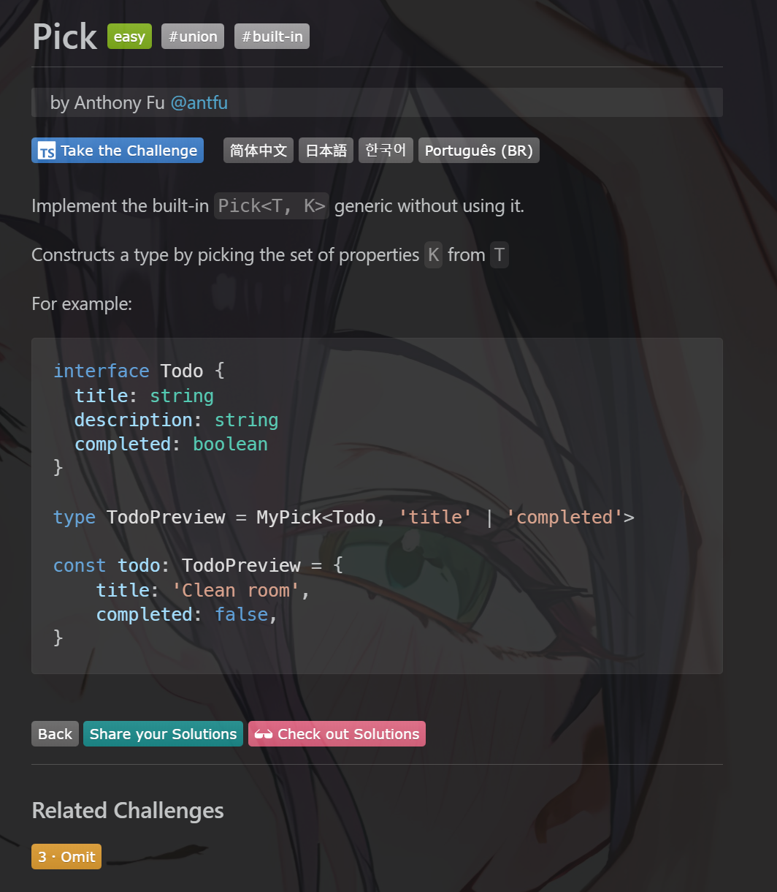
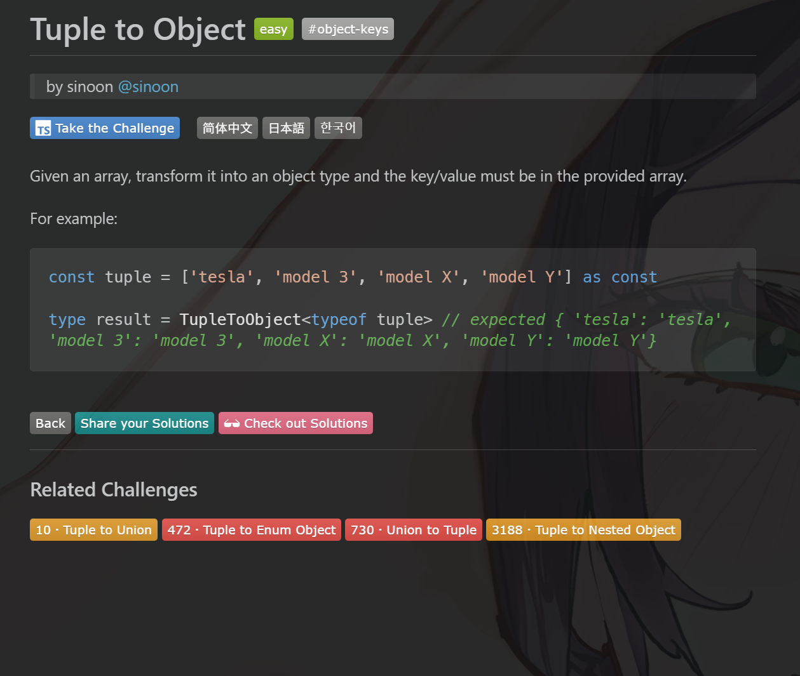
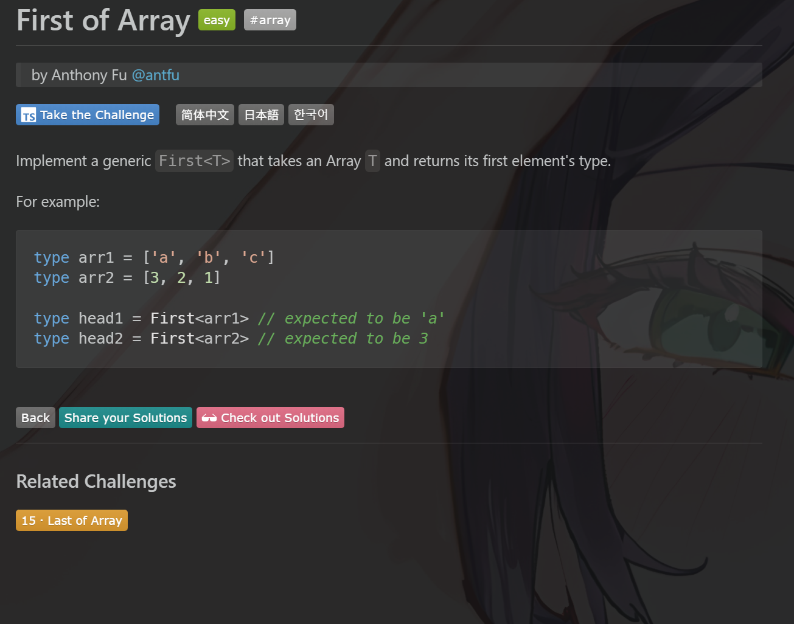
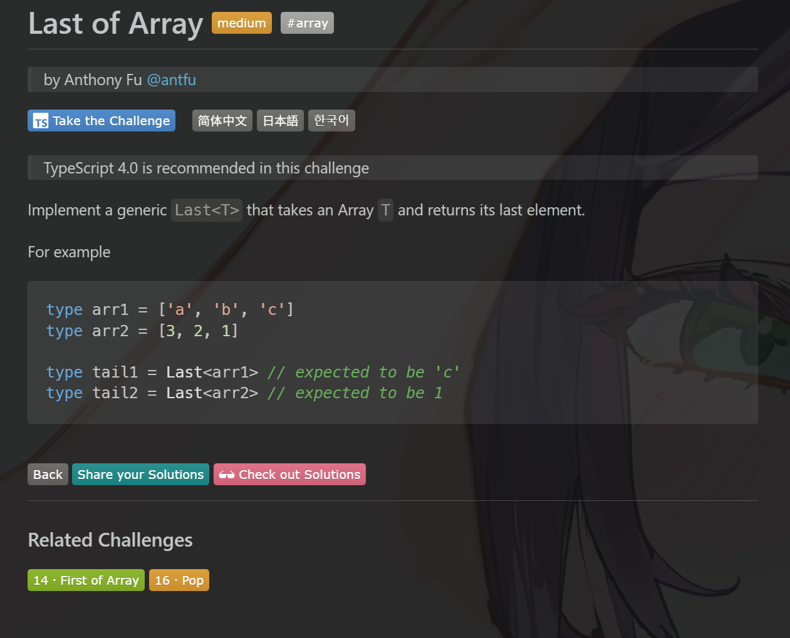
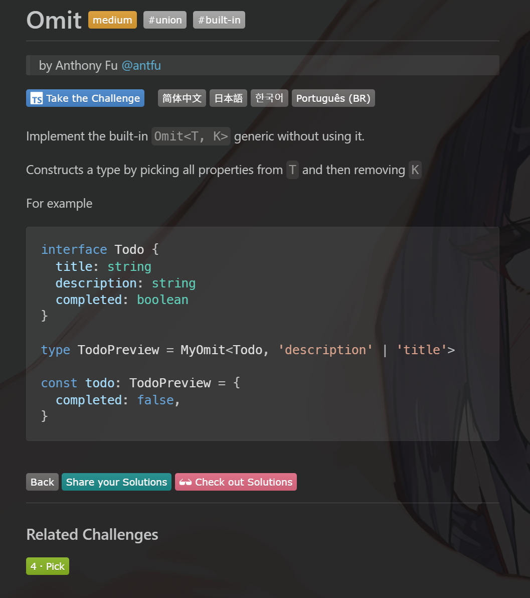
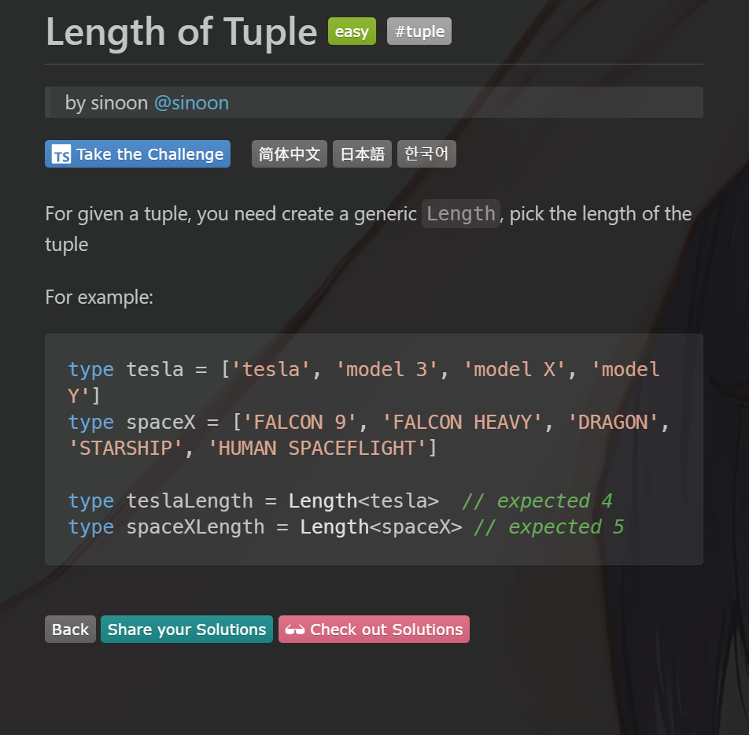

[教程地址](https://www.bilibili.com/video/BV1L2rdB9ECo)

---

## 知识点

### 筛选器联合类型

``` ts

type Circle{
  kind: "circle";
  radius: number;
}

type Square{
  kind: "square";
  slideLength: number;
}

type Shape = Circle | Square

```

``` ts

// 使用分支语句收缩类型
if(s.kind === "circle"){
  s type is Circle 
}else if(s.kind === "square"){
  s type is Square
}

```

## 小技巧

### switch true



## 刷题

[type-challenges](https://github.com/type-challenges/type-challenges)

[视频教程](https://www.bilibili.com/video/BV1vY41187Tx)

学习方法：先用js函数写出来，再翻译成ts类型语法，遇到不会的就查，肯定可以写出来，因为ts的类型语法是图灵完备的，记得总结用到的知识点

### easy-pick

#### easy-pick题目描述



#### easy-pick答案

``` ts
type MyPick<T, K extends keyof T> = {
    [P in K]: T[P]
};


// 刷题思路，先写JS函数，再翻译成TS类型
// function myPick(todo, keys) {
//   const obj = {};
//   keys.forEach(key => {
//     if (key in todo) {
//       obj[key] = todo[key];
//     }
//   });
//   return obj;
// }

/**
 * 1. 返回对象
 * 2. 遍历 keys mapped
 * 4. 判断 key 是否存在与 todo.keys()
 * 3. 取值 todo[key] indexed
 */
```

#### easy-pick知识点

- [mapped文档](https://www.typescriptlang.org/docs/handbook/2/mapped-types.html#handbook-content)

- [indexed文档](https://www.typescriptlang.org/docs/handbook/2/indexed-access-types.html#handbook-content)

### easy-readonly

#### easy-readonly题目描述


#### easy-readonly答案

``` ts

type MyReadonly<T> = {
  readonly [K in keyof T]: T[K];
};

```

#### easy-readonly知识点

[readonly 修饰符](https://www.typescriptlang.org/docs/handbook/typescript-in-5-minutes-func.html#readonly-and-const)

### easy-tuple-to-object

#### easy-tuple-to-object题目描述



#### easy-tuple-to-object答案

``` ts

type TupleToObject<
  T extends readonly (string | number | symbol)[],
> = {
  [P in T[number]]: P;
};

// function tupleToObject(tuple) {
//   const obj: any = {};
//   for (const key in tuple) {
//     obj[tuple[key]] = tuple[key];
//   }
//   return obj;
// }


```

#### easy-tuple-to-object知识点

[T[number]遍历数组](https://www.typescriptlang.org/docs/handbook/2/indexed-access-types.html#handbook-content)

### easy-first

#### easy-first题目描述



#### easy-first答案1- extends undefined

```ts
type First<T extends any[]> =T['length'] extends 0 ? never: T[0];
```

#### easy-first答案2-extends []

```ts
type First<T extends any[]> = T extends [] ? never : T[0];
```

#### easy-first答案3-infer

```ts
type First<T extends any[]> =
  T extends [infer F, ...any[]] ? F : never;
```

#### easy-first知识点

T["length"]可以获取传入的元组数组类型的长度

[extends作为条件判断](https://www.typescriptlang.org/docs/handbook/2/conditional-types.html)

### medium-last

#### medium-last题目描述



#### medium-last答案

```ts
type Last<T extends any[]> =
  T extends [...any[], infer L] ? L : never;

```

#### medium-last知识点

[infer提取类型](https://dev.to/leapcell/a-deep-dive-into-typescripts-infer-keyword-1o4b)

### medium-omit

#### medium-omit题目描述



#### medium-omit答案

```ts
type MyOmit<T, K extends keyof T> = {
  [P in keyof T as P extends K ? never : P]: T[P];
};
```

#### medium-omit知识点

如果as后面是never，则会忽略掉待as的P

### easy-tuple-length

#### easy-tuple-length题目描述



#### easy-tuple-length答案

```ts
type Length<T extends readonly any[]> = T['length'];
```

#### easy-tuple-length知识点

使用 `readonly any[]` 作为元组数组的约束
